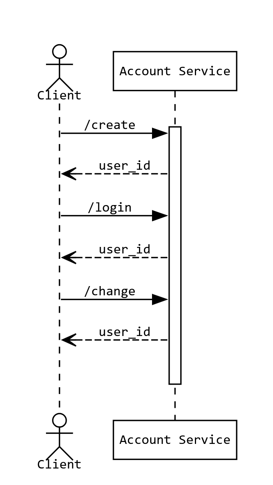

# microservice a: account service




## dependencies

```
$ pip3 install requests flask
```

## running the service

```
$ rm accounts.sqlite # optional, wipes the database
$ flask --app main run
```

## creating an account

```py
import requests
requests.post("http://127.0.0.1:5000/login", json = {
    'username': ...,
    'password': ...,
}).json()
# {'user_id': int}
# OR
# {'error': 'Account already exists'}
```

## logging in to an account

```py
import requests
requests.post("http://127.0.0.1:5000/login", json = {
    'username': ...,
    'password': ...,
}).json()
# {'user_id': int}
# OR
# {'error': 'Invalid username or password'}
```

## changing password of an account

```py
import requests
requests.post("http://127.0.0.1:5000/login", json = {
    'username': ...,
    'password': ...,
    'new_password': ...,
}).json()
# {'user_id': int}
# OR
# {'error': 'Invalid username or password'}
```
